# 🔫 Kubernetes Machine Gun

[](https://skillicons.dev)

**Load testing platform for Kubernetes applications**

```mermaid
graph TD
    MG[Machine Gun 🔫] -->|Load Test| NG[Nginx ⚖️]
    NG -->|Load Balance| FA1[FastAPI 1 🚀]
    NG -->|Load Balance| FA2[FastAPI 2 🚀]
    NG -->|Load Balance| FA3[FastAPI 3 🚀]
    
    FA1 -->|Metrics| PM[Prometheus 📊]
    FA2 -->|Metrics| PM
    FA3 -->|Metrics| PM
    NG -->|Metrics| PM
    
    FA1 -->|Data| PG[(PostgreSQL 🐘)]
    FA2 -->|Data| PG
    FA3 -->|Data| PG
    
    FA1 -->|Queue Tasks| RD[(Redis Queue 🔴)]
    FA2 -->|Queue Tasks| RD
    FA3 -->|Queue Tasks| RD
    
    PM -->|Visualize| GF[Grafana 📈]
    
    classDef machineGun fill:#ff6b6b,stroke:#d63031,stroke-width:3px,color:#fff
    classDef nginx fill:#00b894,stroke:#00a085,stroke-width:2px,color:#fff
    classDef fastapi fill:#6c5ce7,stroke:#5f3dc4,stroke-width:2px,color:#fff
    classDef database fill:#fdcb6e,stroke:#e17055,stroke-width:2px,color:#000
    classDef queue fill:#e84393,stroke:#d63031,stroke-width:2px,color:#fff
    classDef monitoring fill:#74b9ff,stroke:#0984e3,stroke-width:2px,color:#fff
    
    class MG machineGun
    class NG nginx
    class FA1,FA2,FA3 fastapi
    class PG database
    class RD queue
    class PM,GF monitoring
```



## Quick Start

```bash
# Deploy
chmod +x deploy.sh && ./deploy.sh

# Access services
minikube service grafana -n machine-gun
minikube service prometheus -n machine-gun
minikube service nginx -n machine-gun
```

## 💥 Launch Attacks

```bash
# DDoS (1000 RPS)
minikube kubectl -- exec -it deployment/machine-gun -n machine-gun -- \
  python3 machine_gun.py --attack=ddos --target=http://nginx --duration=60 --rps=1000

# Burst (2000 RPS spike)
minikube kubectl -- exec -it deployment/machine-gun -n machine-gun -- \
  python3 machine_gun.py --attack=burst --target=http://nginx --duration=30 --rps=2000

# Sustained (500 RPS)
minikube kubectl -- exec -it deployment/machine-gun -n machine-gun -- \
  python3 machine_gun.py --attack=sustained --target=http://nginx --duration=300 --rps=500
```

## Monitoring

- **Grafana**: `minikube service grafana -n machine-gun` (admin/admin)
- **Prometheus**: `minikube service prometheus -n machine-gun`
- **FastAPI**: `minikube service nginx -n machine-gun`

## Stop Services

```bash
# Stop all services (clean)
minikube kubectl -- delete namespace machine-gun

# Stop Minikube entirely
minikube stop
```

